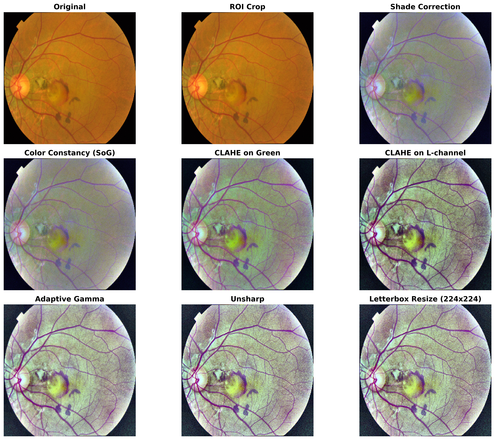
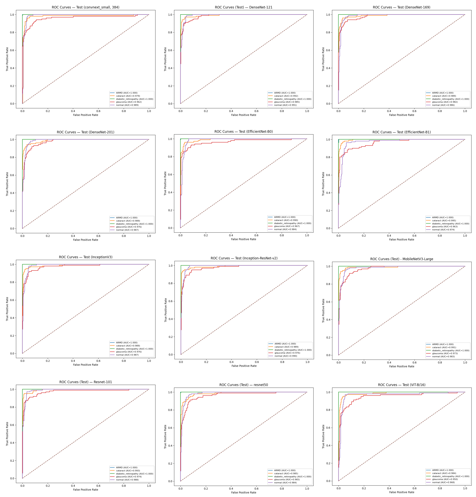
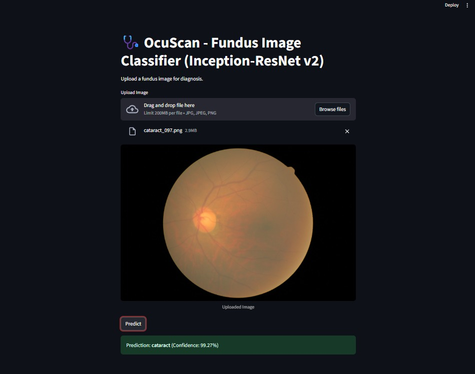

# OcuScan - Retinal Fundus Classification

Comprehensive pipeline for fundus-image classification with a consistent **80/10/10 stratified split**, a robust **preprocessing** stack, mixed-precision **training**, and a **Streamlit GUI** for inference.  

---

## 1) Overview

- Robust fundus preprocessing (ROI crop → shade correction → color constancy → CLAHE (G & L) → adaptive gamma → unsharp → letterbox+resize).
- Model zoo across **224/240/299/384** input sizes.
- **AMP** everywhere, checkpoint on **best val accuracy**, reproducible splits (`SEED=42`).
- Reports: **classification report**, **confusion matrix**, **ROC curves**, **AUC (macro/weighted/micro)**, **train/val curves**.

---

## 2) Data & Preprocessing
The dataset has 4,728 fundus images across five classes. Most samples are diabetic_retinopathy (23.2%, 1,098), followed by normal (22.7%, 1,074), cataract (22.0%, 1,038), and glaucoma (21.3%, 1,007). ARMD is the smallest class at 10.8% (511). Overall it’s fairly balanced among four classes, with ARMD under-represented (largest:smallest ≈ 2.15×), so class-weighted loss or macro metrics are a good idea.


<p align="center">

</p>


### Core preprocessing steps (fundus-specific)
All steps occur in **`preprocess_fundus(img_bgr, size)`** in this order:

1. **ROI crop (`fundus_roi_crop`)**  
   - Threshold low intensities (`gray > 8`) to get a circular mask  
   - Morphological close (7×7) to fill holes  
   - **`robust_bbox_from_mask`**: bounding box with small margin → crop tightly to fundus

2. **Illumination/shade correction (`shade_correction`)**  
   - Divide by heavy Gaussian blur (σ≈40) to remove vignetting/shading; rescale

3. **Color constancy (`shades_of_gray_cc`, p=6)**  
   - Normalizes per-channel gains to reduce color cast

4. **Local contrast on green (`clahe_on_green`)**  
   - CLAHE on the **green channel** (vessels/lesions are prominent in G)

5. **Optional global contrast (`optional_l_channel_clahe`)**  
   - CLAHE on **L (lightness)** in LAB space for overall contrast

6. **Adaptive gamma (`adaptive_gamma`, target=0.42)**  
   - Computes image median brightness → sets gamma to reach target midtone

7. **Sharpen (`unsharp`, σ=1.0, amount=0.5)**  
   - Unsharp masking for detail enhancement

8. **Square letterbox + resize (`letterbox_square`)**  
   - Pads to square (no aspect distortion) and resizes to **224×224 or any other size** (cubic)

<p align="center">

</p>

---

## Parallel processing
- Collects all image files via `rglob`
- Uses `ThreadPoolExecutor(workers)` to **process images concurrently**
- Per-file function: **`process_one`**
  - Skips if output already exists
  - Reads → `preprocess_fundus` → writes → returns status (`ok`, `skipped`, `read_error`, `write_error`, or `error:<msg>`)

---


**Tunable knobs:** CLAHE (clip/tile), shade σ, gamma target, unsharp amount, output size (224/240/299/384).

---

## 3) Model Zoo (current)

All use the same split protocol and training loop style (Adam/AdamW, ReduceLROnPlateau on **val acc**, AMP).

### 224×224 (torchvision)
- **ResNet-50** — `models.resnet50(weights=DEFAULT)` → replace `fc`
- **ResNet-101** — `models.resnet101(weights=DEFAULT)` → replace `fc`
- **MobileNetV3-Large** — replace `classifier[-1]`
- **DenseNet-121/169/201** — replace `classifier`

### 240×240
- **EfficientNet-B1** — resize to **(240,240)**; replace `classifier[1]`

### 299×299
- **InceptionV3** — aux logits (loss = CE(main) + **0.4**·CE(aux))
- **Inception-ResNet-v2 (timm)**

### 384×384
- **ConvNeXt (Tiny/Small/Base)** — optional gradient accumulation for VRAM

> **Removed:** Swin 224→384 two-stage.

---

## 4) Training Recipes

- **Optimizers**
  - CNNs/ResNet/EfficientNet/Inception: **Adam(lr=1e-4)**
  - ConvNeXt: **AdamW(lr=1e-4, weight_decay=5e-4)**
- **Schedulers**: `ReduceLROnPlateau(..., mode="max", factor=0.5, patience=2)` on **val acc**
- **Loss**: CrossEntropy (ViT/ConvNeXt previously used LS=0.1; not used now)
- **AMP**: `torch.amp.autocast` + `GradScaler`
- **Checkpoints**: `checkpoints/<model>_best.pth` with `model_state`, `epoch`, `val_acc`, `classes`

**Input roots**
- 224: `preprocessed224_best`
- 240 (B1): resize in transform
- 299 (Inception*): `preprocessed299_inception` or resize
- 384 (ConvNeXt): `preprocessed384_best`

---


## 5) Fundus Image Classification Models - Results

| Model               | Input | Epochs | Optim | Val Acc (best) | Test Acc | Macro AUC | Weighted AUC | Micro AUC | Checkpoint (UCD GDrive) |
|--------------------|------:|-------:|------|---------------:|---------:|----------:|-------------:|----------:|-------------------------|
| ResNet-50           | 224   | 12     | Adam | 0.9175         | 0.9091   | 0.9867    | 0.9855       | 0.9900    | [resnet50_best.pth](https://drive.google.com/file/d/RESNET50_ID/view?usp=sharing) |
| ResNet-101          | 224   | 12     | Adam | 0.9175         | 0.9471   | 0.9910    | 0.9902       | 0.9931    | [resnet101_best.pth](https://drive.google.com/file/d/RESNET101_ID/view?usp=sharing) |
| MobileNetV3-L       | 224   | 12     | Adam | 0.9281         | 0.9260   | 0.9894    | 0.9884       | 0.9926    | [mobilenetv3_best.pth](https://drive.google.com/file/d/MOBILENETV3_ID/view?usp=sharing) |
| DenseNet-121        | 224   | 12     | Adam | 0.9366         | 0.9302   | 0.9936    | 0.9930       | 0.9952    | [densenet121_best.pth](https://drive.google.com/file/d/DENSENET121_ID/view?usp=sharing) |
| DenseNet-169        | 224   | 12     | Adam | 0.9345         | 0.9302   | 0.9914    | 0.9905       | 0.9936    | [densenet169_best.pth](https://drive.google.com/file/d/DENSENET169_ID/view?usp=sharing) |
| DenseNet-201        | 224   | 12     | Adam | 0.9323         | 0.9281   | 0.9905    | 0.9896       | 0.9934    | [densenet201_best.pth](https://drive.google.com/file/d/DENSENET201_ID/view?usp=sharing) |
| EfficientNet-B0     | 224   | 12     | Adam | 0.9175         | 0.9281   | 0.9882    | 0.9871       | 0.9910    | [efficientnet_b0_best.pth](https://drive.google.com/file/d/EFFNETB0_ID/view?usp=sharing) |
| EfficientNet-B1     | 240   | 12     | Adam | 0.9260         | 0.9112   | 0.9863    | 0.9850       | 0.9905    | [efficientnet_b1_best.pth](https://drive.google.com/file/d/EFFNETB1_ID/view?usp=sharing) |
| InceptionV3         | 299   | 12     | Adam | 0.9281         | 0.9302   | 0.9904    | 0.9895       | 0.9919    | [inceptionv3_best.pth](https://drive.google.com/file/d/INCEPTIONV3_ID/view?usp=sharing) |
| Inception-ResNet-v2 | 299   | 12     | Adam | 0.9302         | 0.9408   | 0.9910    | 0.9901       | 0.9936    | [inception_resnet_v2_best.pth](https://drive.google.com/file/d/INCRESNETV2_ID/view?usp=sharing) |
| ConvNeXt-T/S/B       | 384   | 12     | AdamW| 0.9345         | 0.9302   | 0.9859    | 0.9847       | 0.9890    | [convnext_384best.pth](https://drive.google.com/file/d/CONVNEXT384_ID/view?usp=sharing) |
| ViT-B/16            | 224   | 12     | AdamW| 0.9175         | 0.9133   | 0.9804    | 0.9786       | 0.9815    | [vitb16_best.pth](#) |


---

## 6) Evaluation

Per model:
- **Classification report** (precision/recall/F1 per class)
- **Confusion matrix**
  <p align="center">
   
</p>

- **ROC curves** (per class)
    <p align="center">
   
</p>

- **Train/Val curves** (acc, loss)
---

## 7) GUI
OcuScan provides a **Streamlit-based GUI** for single-image fundus classification using the **best model: Inception-ResNet-v2**.

### Features

- **Upload a fundus image** (`jpg`, `jpeg`, `png`)  
- **Automatic preprocessing**:
  - ROI crop → Shade correction → Color constancy → CLAHE → Gamma correction → Unsharp → Letterbox  
- **Model supported**: **Inception-ResNet-v2 (best-performing model)**  
- Shows **predicted class** and **confidence score**  
- **GPU/CPU support**: Uses `torch.device("cuda" if available else "cpu")` 

---

### Installation

Install the required Python packages:

```bash
pip install torch torchvision timm opencv-python-headless streamlit pillow numpy
```

### Launch the GUI
`streamlit run app.py`

### Using the GUI

- **Upload Image**: Click the "Browse files" button and select a fundus image.
- **View Image**: The uploaded image is displayed.
- **Predict**: Click the "Predict" button to classify the image.
- **Results**: The predicted class and confidence percentage are shown.

### Example Interface
<p align="center">
   
</p>
