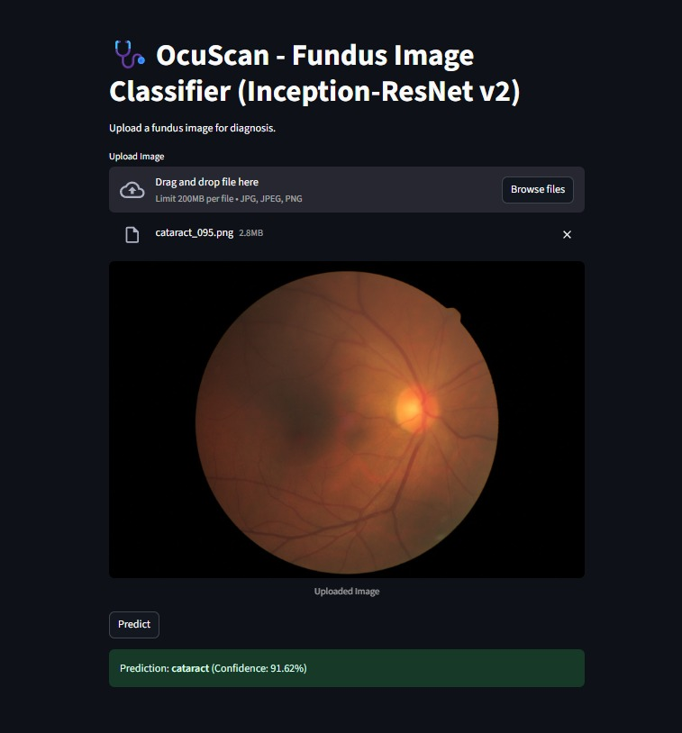

# OcuScan - Retinal Fundus Classification

<p align="center">

</p>

---
## Table of Contents

- [1) Overview](#1-overview)
- [2) Project Flow and Structure](#2-project-flow-and-structure)
  - [Project Flow](#project-flow)
  - [Project Structure](#project-structure)
- [3) Data & Preprocessing](#3-data--preprocessing)
  - [Core preprocessing steps (fundus-specific)](#core-preprocessing-steps-fundus-specific)
  - [Parallel processing](#parallel-processing)
- [4) Model Zoo (current)](#4-model-zoo-current)
- [5) Training Recipes](#5-training-recipes)
- [6) Fundus Image Classification Models - Results](#6-fundus-image-classification-models---results)
- [7) Evaluation](#7-evaluation)
  - [Confusion matrix](#confusion-matrix)
  - [ROC curves (per class)](#roc-curves-per-class)
  - [Training and Validation Performance curves (acc-loss)](#training-and-validation-performance-curves-acc-loss)
- [8) GUI](#8-gui)
  - [Features](#features)
  - [Installation](#installation)
  - [Launch the GUI](#launch-the-gui)
  - [Using the GUI](#using-the-gui)
  - [Example Interface](#example-interface)
- [9) Project Poster](#9-project-poster)
- [10) References](#10-references)
- [11) Contact](#11-contact)
---

## 1) Overview

OcuScan is an end-to-end deep learning pipeline designed for the automated classification of retinal fundus images. Built to support ophthalmologists and streamline disease screening, OcuScan offers robust preprocessing, state-of-the-art model architectures, efficient training strategies and an intuitive GUI for point-of-care inference.

The system tackles clinical challenges such as class imbalance and disease diversity by leveraging a carefully balanced dataset, standardized preprocessing steps and advanced models—including ResNet, DenseNet, EfficientNet, Inception, ConvNeXt and Vision Transformer—optimized for input sizes ranging from 224×224 to 384×384. Among these, **Inception-ResNet-v2 stands out as the best-performing architecture, achieving a test accuracy of 94.08%**, and delivering superior classification robustness for retinal fundus images. Mixed-precision training ensures computational efficiency while checkpointing and reproducible stratified splits maintain reliability and transparency. 

OcuScan’s integrated workflow encompasses image enhancement (ROI crop, illumination correction, color normalization, contrast improvement, sharpening and resizing) and thorough evaluation protocols (confusion matrix, classification report, ROC/AUC metrics and training curves). The Streamlit-based frontend provides an accessible interface for rapid, single-image diagnosis using the top-performing multi-class model with automatic preprocessing and real-time confidence scores.

By combining best practices in medical image preprocessing and deep learning model development, OcuScan delivers a clinical-grade solution for multi-disease retinal analysis, supporting both research and real-world deployment.

---

## 2) Project Flow and Structure

### Project Flow
<p align="center">

</p>

### Project Structure
```bash 
project-project-in-maths-modelling-sn/
├── dataset/                        # Raw/master dataset files
├── preprocessed224_best/           # Preprocessed 224x224 images
├── preprocessed299_inception/      # Preprocessed 299x299 images
├── preprocessed384_best/           # Preprocessed 384x384 images
├── images/                         # Visualizations and plots
├── notebooks/                      # Jupyter notebooks
│   ├── ConvNext.ipynb
│   ├── DenseNet.ipynb
│   ├── EfficientNet.ipynb
│   ├── Inception.ipynb
│   ├── Preprocessing.ipynb
│   ├── ResNet-50_101.ipynb
│   ├── VisionTransformer.ipynb
│   ├── MobileNet.ipynb
├── app/                            # Streamlit GUI frontend
│   ├── frontend_fundus.py
├── Poster.pdf                      # Project poster
├── literature_review.pdf           # References and review papers
├── requirements.txt                # Python package dependencies
├── README.md                       # Project documentation
```
---

## 3) Data & Preprocessing
The dataset contains **4,728 fundus images** across five classes:  

- **Diabetic retinopathy**: 1,098 samples (23.2%)  
- **Normal**: 1,074 samples (22.7%)  
- **Cataract**: 1,038 samples (22.0%)  
- **Glaucoma**: 1,007 samples (21.3%)  
- **ARMD**: 511 samples (10.8%)

<p align="center">

</p>

Overall, the dataset is fairly balanced across four classes, with **ARMD under-represented** (largest:smallest ≈ 2.15×).  
This imbalance makes **class-weighted loss functions** or the use of **macro-averaged metrics** (precision, recall, F1) a good choice for evaluation.  

**Dataset source**: [Ocular Disease Recognition (Fundus Images)](https://www.kaggle.com/datasets/amrsalemhelmy/ocular-disease) on *Kaggle*.

### Core preprocessing steps (fundus-specific)
All steps occur in **`preprocess_fundus(img_bgr, size)`** in this order:

1. **ROI crop (`fundus_roi_crop`)**  
   - Threshold low intensities (`gray > 8`) to get a circular mask  
   - Morphological close (7×7) to fill holes  
   - **`robust_bbox_from_mask`**: bounding box with small margin → crop tightly to fundus

2. **Illumination/shade correction (`shade_correction`)**  
   - Divide by heavy Gaussian blur (σ≈40) to remove vignetting/shading; rescale

3. **Color constancy (`shades_of_gray_cc`, p=6)**  
   - Normalizes per-channel gains to reduce color cast

4. **Local contrast on green (`clahe_on_green`)**  
   - CLAHE on the **green channel** (vessels/lesions are prominent in G)

5. **Optional global contrast (`optional_l_channel_clahe`)**  
   - CLAHE on **L (lightness)** in LAB space for overall contrast

6. **Adaptive gamma (`adaptive_gamma`, target=0.42)**  
   - Computes image median brightness → sets gamma to reach target midtone

7. **Sharpen (`unsharp`, σ=1.0, amount=0.5)**  
   - Unsharp masking for detail enhancement

8. **Square letterbox + resize (`letterbox_square`)**  
   - Pads to square (no aspect distortion) and resizes to **224×224 or any other size** (cubic)

<p align="center">

</p>

---

## Parallel processing
- Collects all image files via `rglob`
- Uses `ThreadPoolExecutor(workers)` to **process images concurrently**
- Per-file function: **`process_one`**
  - Skips if output already exists
  - Reads → `preprocess_fundus` → writes → returns status (`ok`, `skipped`, `read_error`, `write_error`, or `error:<msg>`)

---


**Tunable knobs:** CLAHE (clip/tile), shade σ, gamma target, unsharp amount, output size (224/240/299/384).

---

## 4) Model Zoo (current)

All use the same split protocol and training loop style (Adam/AdamW, ReduceLROnPlateau on **val acc**, AMP).

### 224×224 (torchvision)
- **ResNet-50** — `models.resnet50(weights=DEFAULT)` → replace `fc`
- **ResNet-101** — `models.resnet101(weights=DEFAULT)` → replace `fc`
- **MobileNetV3-Large** — replace `classifier[-1]`
- **DenseNet-121/169/201** — replace `classifier`

### 240×240
- **EfficientNet-B1** — resize to **(240,240)**; replace `classifier[1]`

### 299×299
- **InceptionV3** — aux logits (loss = CE(main) + **0.4**·CE(aux))
- **Inception-ResNet-v2 (timm)**

### 384×384
- **ConvNeXt (Tiny/Small/Base)** — optional gradient accumulation for VRAM

> **Removed:** Swin 224→384 two-stage.

---

## 5) Training Recipes

- **Optimizers**
  - CNNs/ResNet/EfficientNet/Inception: **Adam(lr=1e-4)**
  - ConvNeXt: **AdamW(lr=1e-4, weight_decay=5e-4)**
- **Schedulers**: `ReduceLROnPlateau(..., mode="max", factor=0.5, patience=2)` on **val acc**
- **Loss**: CrossEntropy (ViT/ConvNeXt previously used LS=0.1; not used now)
- **AMP**: `torch.amp.autocast` + `GradScaler`
- **Checkpoints**: `checkpoints/<model>_best.pth` with `model_state`, `epoch`, `val_acc`, `classes`

- **Input roots**
  - 224: `preprocessed224_best`
  - 240 (B1): resize in transform
  - 299 (Inception*): `preprocessed299_inception` or resize
  - 384 (ConvNeXt): `preprocessed384_best`

- **Model Architecture - Inception-ResNet-v2**
<p align="center">

</p>

The model takes a 299×299 image as input, passes it through a convolutional stem, then through stacks of Inception-ResNet-A (×5), Reduction-A, Inception-ResNet-B (×10), Reduction-B and Inception-ResNet-C (×5) modules. These specialized blocks combine inception-style multi-scale feature extraction with residual connections, improving both accuracy and training stability. Finally, global average pooling and a fully connected (FC) layer produce the class probabilities (5 classes).

---


## 6) Fundus Image Classification Models - Results

| Model               | Input | Epochs | Optim | Val Acc (best) | Test Acc | Precision | Recall | F1-score | Macro AUC | Weighted AUC | Micro AUC | Checkpoint (UCD GDrive) |
|---------------------|------:|-------:|-------|---------------:|---------:|----------:|-------:|---------:|----------:|-------------:|----------:|-------------------------|
| ResNet-50           | 224   | 12     | Adam  | 0.9175         | 0.9091   | 0.9177    | 0.9172 | 0.9173   | 0.9867    | 0.9855       | 0.9900    | [resnet50_best.pth](https://drive.google.com/file/d/RESNET50_ID/view?usp=sharing) |
| ResNet-101          | 224   | 12     | Adam  | 0.9175         | 0.9133   | 0.9218    | 0.9206 | 0.9208   | 0.9888    | 0.9878       | 0.9915    | [resnet101_best.pth](https://drive.google.com/file/d/RESNET101_ID/view?usp=sharing) |
| MobileNetV3-L       | 224   | 12     | Adam  | 0.9281         | 0.9197   | 0.9292    | 0.9262 | 0.9266   | 0.9858    | 0.9845       | 0.9895    | [mobilenetv3_best.pth](https://drive.google.com/file/d/MOBILENETV3_ID/view?usp=sharing) |
| DenseNet-121        | 224   | 12     | Adam  | 0.9366         | 0.9307   | 0.9376    | 0.9359 | 0.9358   | 0.9936    | 0.9930       | 0.9952    | [densenet121_best.pth](https://drive.google.com/file/d/DENSENET121_ID/view?usp=sharing) |
| DenseNet-169        | 224   | 12     | Adam  | 0.9345         | 0.9305   | 0.9371    | 0.9362 | 0.9363   | 0.9914    | 0.9905       | 0.9936    | [densenet169_best.pth](https://drive.google.com/file/d/DENSENET169_ID/view?usp=sharing) |
| DenseNet-201        | 224   | 12     | Adam  | 0.9323         | 0.9281   | 0.9344    | 0.9341 | 0.9341   | 0.9905    | 0.9896       | 0.9934    | [densenet201_best.pth](https://drive.google.com/file/d/DENSENET201_ID/view?usp=sharing) |
| EfficientNet-B0     | 224   | 12     | Adam  | 0.9175         | 0.9281   | 0.9350    | 0.9345 | 0.9346   | 0.9882    | 0.9871       | 0.9910    | [efficientnet_b0_best.pth](https://drive.google.com/file/d/EFFNETB0_ID/view?usp=sharing) |
| EfficientNet-B1     | 240   | 12     | Adam  | 0.9260         | 0.9112   | 0.9208    | 0.9192 | 0.9196   | 0.9863    | 0.9850       | 0.9905    | [efficientnet_b1_best.pth](https://drive.google.com/file/d/EFFNETB1_ID/view?usp=sharing) |
| InceptionV3         | 299   | 12     | Adam  | 0.9281         | 0.9302   | 0.9402    | 0.9355 | 0.9353   | 0.9904    | 0.9895       | 0.9919    | [inceptionv3_best.pth](https://drive.google.com/file/d/INCEPTIONV3_ID/view?usp=sharing) |
| Inception-ResNet-v2 | 299   | 12     | Adam  | 0.9302         | 0.9408   | 0.9444    | 0.9457 | 0.9448   | 0.9910    | 0.9901       | 0.9936    | [inception_resnet_v2_best.pth](https://drive.google.com/file/d/INCRESNETV2_ID/view?usp=sharing) |
| ConvNeXt-T/S/B      | 384   | 12     | AdamW | 0.9345         | 0.9302   | 0.9367    | 0.9357 | 0.9354   | 0.9859    | 0.9847       | 0.9890    | [convnext_384best.pth](https://drive.google.com/file/d/CONVNEXT384_ID/view?usp=sharing) |
| ViT-B/16            | 224   | 12     | AdamW | 0.9175         | 0.9133   | 0.9218    | 0.9204 | 0.9205   | 0.9804    | 0.9786       | 0.9815    | [vitb16_best.pth](#) |


Across multiple architectures trained for 12 epochs, Inception-ResNet-v2 delivered the best test accuracy (94.1%) with the highest macro F1-score (0.9448) and strong AUCs (macro 0.9910, micro 0.9936). DenseNet-121 achieved the best overall balance, with 93.7% validation accuracy, 93.0% test accuracy, excellent precision/recall/F1 (0.9376/0.9359/0.9358) and the strongest macro/weighted AUC (0.9936/0.9930). Other DenseNet variants (169/201) and ConvNeXt also maintained robust generalization with F1-scores above 0.934. Lightweight models like MobileNetV3-L performed competitively (92.0% test F1, 92.2% accuracy) and represent efficient alternatives. While InceptionV3 (93.0% accuracy, F1 = 0.9353) also ranked among the top CNNs, transformer-based ViT-B/16 underperformed relative to CNNs (91.3% accuracy, F1 = 0.9205). Overall, DenseNet and Inception-ResNet architectures proved most effective, while EfficientNet and MobileNet offered accuracy–efficiency tradeoffs suitable for practical deployment.

---

## 7) Evaluation

### **Confusion matrix**
<p align="center">
   
</p>

The confusion matrices for the tested models reveal strong classification performance across all disease categories, with most models correctly identifying the majority of cases in each class. Diabetic retinopathy and normal fundus images show particularly high true positive rates, while cataract and glaucoma have occasional misclassifications, most frequently with normal and each other. Inception-ResNet-v2 and DenseNet variants consistently demonstrate minimal confusion among classes, maintaining clarity in distinguishing between retinal pathologies. Overall, these results highlight the capability for reliable, multi-disease detection with low error rates and high diagnostic precision across advanced deep learning architectures.

### **ROC curves** (per class)
<p align="center">
   
</p>

The ROC curve plots for all tested models demonstrate outstanding discriminatory ability in fundus image classification, with each disease class achieving high AUC values close to 1.0. These curves show that OcuScan’s approach yields excellent sensitivity and specificity across a diverse set of deep learning architectures. Inception-ResNet-v2, DenseNet and EfficientNet models consistently deliver superior separability for diabetic retinopathy, cataract, glaucoma, ARMD and normal cases, indicating that true and false positive rates are well balanced at various thresholds.

### **Training and Validation Performance curves** (acc, loss)
<p align="center">
   
</p>

The training curves for OcuScan’s models illustrate efficient convergence, with losses consistently decreasing and accuracies rapidly increasing across epochs for both training and validation sets. While training accuracy approaches 1.0 for all models, validation accuracy stabilizes between 0.91 and 0.94, reflecting minimal overfitting. Validation loss remains relatively steady, supporting the pipeline’s reliability and reproducibility. These results collectively demonstrate effective optimization and sustained performance throughout training.

---
## 8) GUI
OcuScan provides a **Streamlit-based GUI** for single-image fundus classification using the **best model: Inception-ResNet-v2**.

### Features

- **Upload a fundus image** (`jpg`, `jpeg`, `png`)  
- **Automatic preprocessing**:
  - ROI crop → Shade correction → Color constancy → CLAHE → Gamma correction → Unsharp → Letterbox  
- **Model supported**: **Inception-ResNet-v2 (best-performing model)**  
- Shows **predicted class** and **confidence score**  
- **GPU/CPU support**: Uses `torch.device("cuda" if available else "cpu")` 

---

### Installation

Install the required Python packages:

```bash
pip install torch torchvision timm opencv-python-headless streamlit pillow numpy os gdown
```

### Launch the GUI
```bash
streamlit run app/frontend_fundus.py
```
### Using the GUI

- **Upload Image**: Click the "Browse files" button and select a fundus image.
- **View Image**: The uploaded image is displayed.
- **Predict**: Click the "Predict" button to classify the image.
- **Results**: The predicted class and confidence percentage are shown.

### Example Interface
<p align="center">
   
</p>

---
## 9) Project Poster

[**Download the Poster (PDF)**](Poster.pdf)

---
## 10) References

- Y. Li, Q. Lao, Q. Kang, Z. Jiang, S. Du, S. Zhang, and K. Li, “Self-supervised anomaly detection, staging and segmentation for retinal images,” Medical Image Analysis, vol. 87, p. 102805, 2023.
- A. Bhati, N. Gour, P. Khanna, and A. Ojha, “Discriminative kernel convolution network for multi-label ophthalmic disease detection on imbalanced fundus image dataset,” Computers in Biology and Medicine, vol. 153, p. 106519, 2023.
- O. Sivaz and M. Aykut, “Combining efficientnet with ml-decoder classification head for multi-label retinal disease classification,” Neural Computing and Applications, vol. 36, no. 23, pp. 14251–14261, 2024.

---
## 11) Contact
- Sudhanshu Nerkar - sudhanshu.nerkar@ucdconnect.ie
- Vedarth Kumtekar - vedarth.rajukumtekar@ucdconnect.ie
